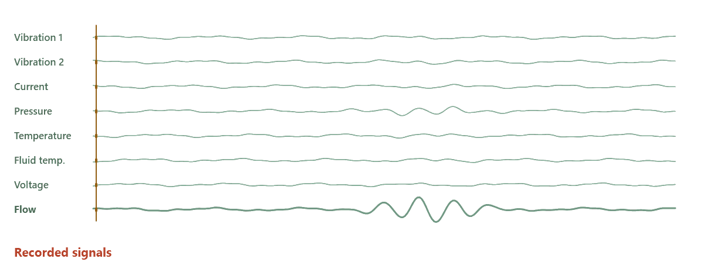
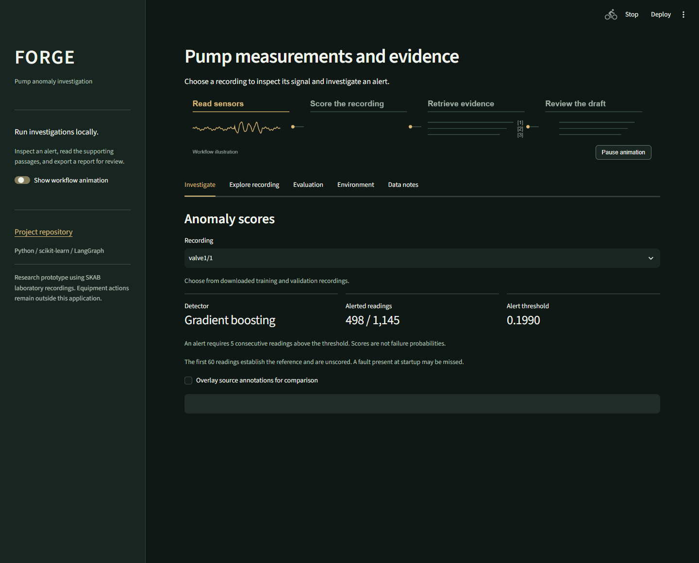
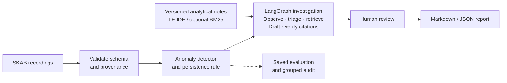
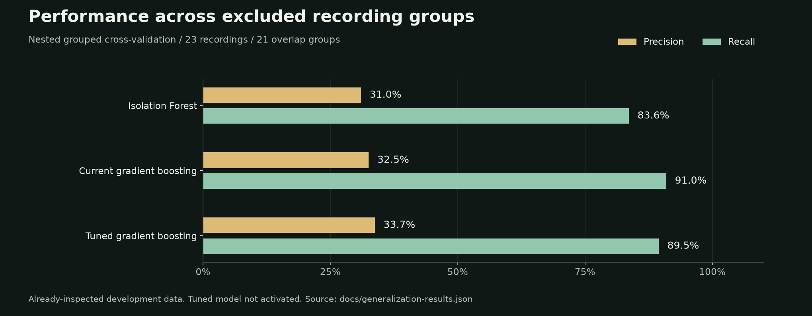
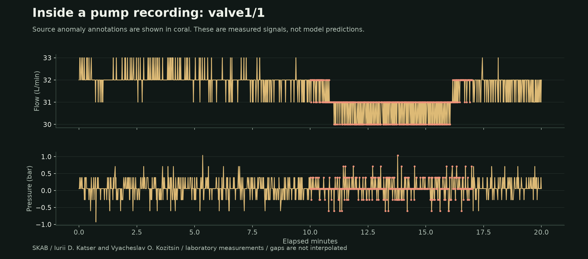

# FORGE

Investigate pump anomalies from recorded sensor data. FORGE scores a recording,
retrieves relevant analytical notes, and builds a cited report for human review.

<picture>
  <source media="(prefers-reduced-motion: reduce) and (prefers-color-scheme: dark)" srcset="docs/assets/workflow-static-dark.png">
  <source media="(prefers-reduced-motion: reduce)" srcset="docs/assets/workflow-static.png">
  <source media="(prefers-color-scheme: dark)" srcset="docs/assets/workflow-dark.gif">
  
</picture>

*Workflow illustration. Static versions: [light](docs/assets/workflow-static.png) / [dark](docs/assets/workflow-static-dark.png).*

[Run locally](#run-locally) · [Architecture](#architecture) · [Results](#what-the-models-show) · [Code walkthrough](docs/code-walkthrough.md)

## The app

Choose a recording, inspect persistent alerts, and read the passages used in the
investigation. Export the draft as Markdown or JSON, or record a named review first.



The Streamlit workflow runs on local policy agents and TF-IDF retrieval. Guidance
is copied from versioned, project-authored notes with citation checks. The separate
[Qwen CLI](docs/local-llm.md) supports model-selected tools, BM25 retrieval and
unreviewed LLM drafts through Ollama, either locally or on
[EnsiCompute](docs/ensicompute.md). Equipment-specific documentation remains future
work. The [PyTorch and BM25 demo](docs/increment-demo.md) provides an optional
neural detector and another retrieval option.

## Architecture



Python, scikit-learn, Streamlit, Plotly, LangGraph and Pydantic support the working
pipeline. Data loading, modeling, retrieval, orchestration and reports have separate
modules. [Implementation and boundaries](docs/architecture.md).

An optional [OPC UA capture prototype](docs/opcua-demo.md) replays a development
recording through a local simulated server. Its read-only client checks complete
eight-channel frames, quality and timing before saving an audited capture for
offline detector comparison. It has not been connected to a PLC or plant network.

## What the models show

The active detector uses supervised gradient boosting with changes relative to
each recording's first 60 readings. Those startup readings are unscored. Isolation
Forest remains the original baseline.



The completed audit uses five outer folds across 21 overlap groups, with tuning
inside three inner folds. Tuning increased precision slightly, but false alert
episodes rose from 137 to 220. The tuned artifact has not been activated.

Earlier model selection reached 95.1% precision and 65.8% recall on one validation
allocation. The audit shows how sensitive performance is to the recording groups.
Both analyses use already-inspected development data. New recordings are needed
for a stronger generalization claim.

A subsequent [causal score-filter comparison](docs/refinement-results.md) reduced
false alert onsets from 137 to 41 under the same grouped development protocol.
False-positive readings changed only from 16,079 to 15,836, and median detected
event delay increased from 6.5 to 20.5 seconds. The filter remains experimental;
it does not resolve the detector's high false-positive rate.

A [matched CatBoost and TabM comparison](docs/modern-comparison-results.md) separates
precision-weighted threshold selection from classifier changes. With F0.5
selection, HGB reaches 63.8% precision and 63.1% recall, ordered CatBoost 71.5%
and 64.5%, and compact TabM 83.4% and 56.1%. TabM reduces false-positive readings
to 954, but produces 216 false alert onsets versus CatBoost's 69. These procedures
remain experimental and are evaluated on reused development recordings.

[Grouped audit and reproduction](docs/generalization-results.md) · [Development comparison](docs/improvement-results.md) · [Historical baseline](docs/evaluation.md)

## The data



FORGE uses [SKAB](https://github.com/waico/SKAB), a laboratory pump dataset by
Iurii D. Katser and Vyacheslav O. Kozitsin. The inventory pins source revisions and
checksums, and overlapping recordings stay in the same split. Source annotations
are separate from model inputs. They identify anomalies, not confirmed equipment
failures. [Provenance, sensors and sampling](data/README.md).

## Run locally

Windows and Python 3.13 are the verified setup. In the cloned repository, run:

```powershell
python -m venv .venv
.\.venv\Scripts\python.exe -m pip install -r requirements-lock.txt
.\.venv\Scripts\python.exe -m pip install --no-deps --no-build-isolation -e .
.\.venv\Scripts\python.exe -m forge.data.partitions --split train --download --audit
.\.venv\Scripts\python.exe -m forge.data.partitions --split validation --download --audit
.\.venv\Scripts\python.exe -m forge train
.\.venv\Scripts\python.exe -m forge app
```

Open [localhost:8511](http://127.0.0.1:8511). This creates the original baseline.
Follow the [development comparison](docs/improvement-results.md#reproduce-and-inspect)
to reproduce and activate the supervised model. No API key or connected equipment is required for this workflow.

[Setup, CLI export and checks](docs/getting-started.md) · [Analysis notebooks](notebooks/)

## License

Copyright (c) 2026 Dang Duong Dang Khoa. Original code and documentation use
[Apache License 2.0](LICENSE), with commercial and noncommercial use permitted
under its terms. Preserve the applicable [NOTICE](NOTICE) and
[attribution](ATTRIBUTION.md). Third-party data and dependencies retain their own
licenses.
