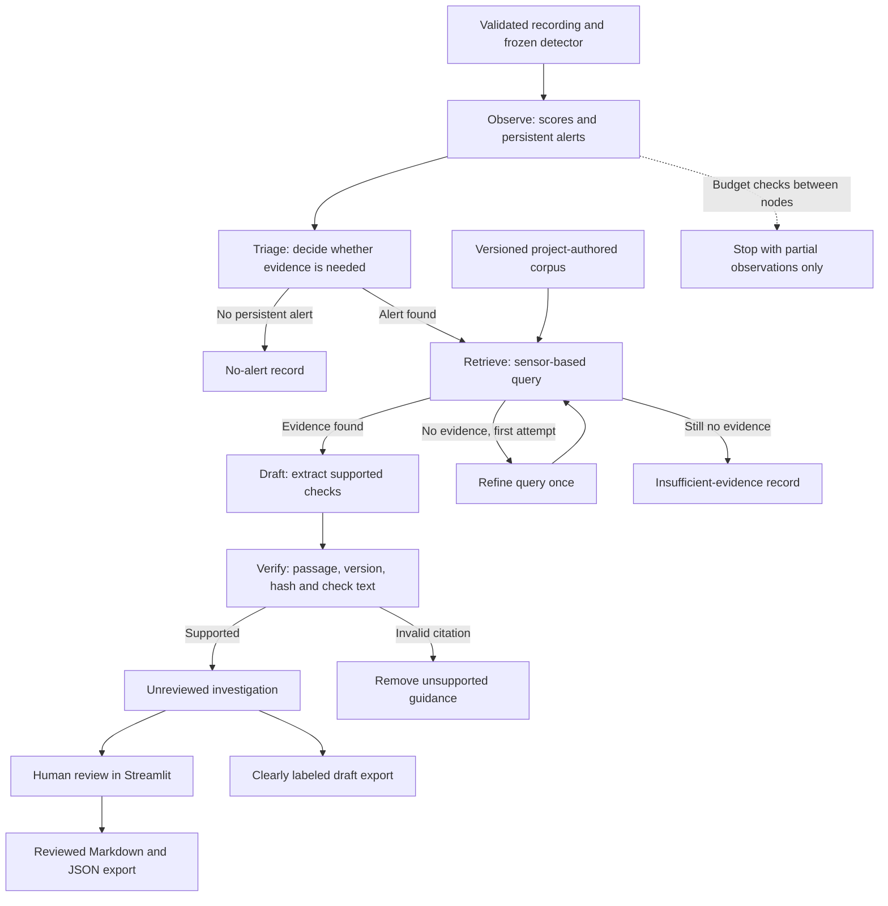

# Architecture

FORGE scores recorded sensor data and retrieves analytical notes for human review.
The Streamlit application uses a frozen scikit-learn detector, TF-IDF retrieval
and a LangGraph workflow whose decisions follow Python rules. It runs on real
SKAB recordings without a provider account or API key. A separate
[Qwen command-line workflow](local-llm.md) lets a language model choose tools and
draft an explanation through Ollama, locally or on
[EnsiCompute](ensicompute.md).

## Data and model boundary

The inventory pins each source recording to a revision and checksum. Loading
checks numeric values, timestamp order, schema, and metadata. The fixed split
keeps overlap-connected recordings together. The original baseline fits normal
training rows; supervised development uses training anomaly annotations as targets.
Validation chooses the detector and threshold. Explicit baseline test evaluation
is separate from the application and returns the cached result on subsequent calls.

`data/datasets.py` constructs the eight-column feature table and deduplicates
evaluation groups. `ml/detectors.py` implements the statistical reference and
Isolation Forest. `ml/metrics.py` applies causal persistence and computes point
and event metrics. `ml/training.py` saves a local model, configuration, hashes,
library version, and validation results in a unique run directory.

`ml/operating.py` builds causal relative and rolling features. `ml/development.py`
compares candidates on development validation, initializing each source recording
before deduplication to match serving. `ml/activation.py` selects a verified local
artifact for investigations through `models/active.json`, preserving the original
baseline pointer. A relative detector needs 60 initialization readings; these
are explicitly unscored. A recording containing only initialization readings
returns `insufficient_data` without retrieving guidance. See the
[precision comparison](improvement-results.md) for the supervised model and limits.

Pickled models are trusted local artifacts created by the training command.
They must never be supplied as uploads or downloaded from an untrusted source.
Checksums detect accidental corruption; replacing both a model and its manifest
would bypass them. Loading checks the scikit-learn version and manifest hashes.

## Investigation graph

In this graph, each agent is a Python role with fixed decision rules. LangGraph
carries typed state between roles, follows conditional branches, permits one
query refinement and records the review outcome. Drafting copies checks from
retrieved passages. This path uses neither a language model nor free-form
planning. The graph makes the decision path inspectable, although it has not
been shown to outperform a simpler implementation.

The observation tool selects the highest-scoring persistent alert episode
without seeing labels. It returns the episode bounds and the three largest
robust sensor deviations at the score peak. These are reference comparisons,
not causal explanations or Isolation Forest feature attributions. The evidence
query uses sensor names, never the experiment's known condition or annotations.

## Retrieval and grounding

`knowledge/playbook.json` contains seven versioned analytical passages. They are
original project guidance, explicitly separate from manufacturer instructions.
The source reference documents sensor and annotation definitions; it does not
validate a fault diagnosis. Each passage is indexed with its title, sensor terms,
text and proposed analytical check using word unigrams/bigrams and TF-IDF.
Cosine similarity selects up to three passages above 0.12 similarity.

This lexical method has no embeddings, reranker, PDF ingestion, or language-model
generation. It can miss paraphrases and retrieve weak lexical matches. The
small [query set](../knowledge/retrieval-cases.json) is a disclosed development
regression set, not an independent measure of NLP generalization.

Drafting copies a supported check from each retrieved passage. Verification
requires the passage ID, version, corpus hash, title, excerpt and check text to
match the loaded corpus. A check must be paired with that exact citation.
This guarantees provenance for copied guidance; it does not prove that the
guidance diagnoses the observed event. Root-cause claims are not generated.
Documents are data: they cannot select tools, change budgets or execute commands.

## Execution and review limits

Default budgets are eight role steps, three local tool calls, 20 seconds checked
between tools, and 20,000 input rows. LangGraph also caps recursion. The time
budget is cooperative, not a hard process interrupt. Scoring counts as one tool
call, and retrieval gets at most two attempts. Budget exhaustion removes partial
guidance and preserves only measured observations. No evidence results in an
explicit abstention; invalid citations remove the draft's guidance.

No network tools, shell, equipment control, or maintenance-system writes are
available to the graph. Ambient LangSmith tracing is explicitly disabled.
Setting the reserved provider environment variables does not enable LLM calls
in this graph. The separate Qwen command requires explicit enablement for each
run. Hosted API support remains unimplemented and would need an explicit opt-in
and spending limit.

`reports/incident.py` defines the report schema. Every result starts unreviewed.
The UI requires a reviewer name and an explicit acknowledgment before marking a
grounded report reviewed. Review is an annotation, not approval to operate
equipment. Both draft and reviewed exports keep their status and provenance.
CLI exports remain drafts; existing files are not silently overwritten.

## Storage and next extensions

Raw data, model binaries, generated reports, credentials and local assistant
notes are ignored. Source manifests, the small original corpus, configuration,
aggregate benchmark results, and code remain tracked. The app has no server-side
account system and is intended for local use.

The precision-focused development protocol is implemented. Further evaluation
needs fresh recordings, applicable equipment documentation and an independent
assessment of the LLM drafts. Computer vision remains optional. Nameplate
recognition could identify an asset, with human confirmation before selecting
its documentation.

Implementation references: [LangGraph graph API](https://docs.langchain.com/oss/python/langgraph/graph-api),
[scikit-learn TF-IDF](https://scikit-learn.org/stable/modules/generated/sklearn.feature_extraction.text.TfidfVectorizer.html),
and [Isolation Forest](https://scikit-learn.org/stable/modules/generated/sklearn.ensemble.IsolationForest.html).
