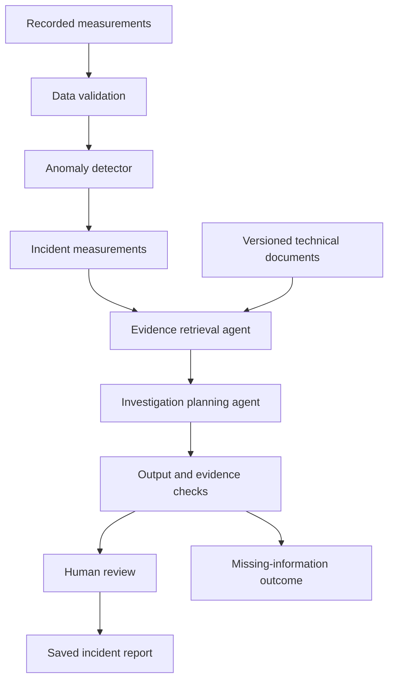

# Architecture

FORGE investigates equipment anomalies by combining numerical measurements and
technical references. Pumps are the first equipment domain.

## Implemented path

The sample manifest pins one SKAB experiment to an upstream revision and checksum.
An explicit download command fetches the file. The loader checks its integrity,
timestamps, numeric values, and annotations. Streamlit displays sensor plots,
source labels, and a data-quality audit. App rendering does not download data or
call a model provider.

Reusable code lives in `src/forge/data/`; the interface lives in `src/forge/ui/`.
The application uses an editable package installation and local files.

## Planned investigation path

The detector supplies computed sensor findings to the language model. An anomaly
score is not a diagnosis or a calibrated failure probability.

The evidence role selects approved retrieval tools and can refine a query once
in the first release. The planning role organizes observations, supported
hypotheses, and missing information into a structured report. Python code controls
tool budgets, state transitions, and output validation. LangGraph will coordinate
the workflow; product agent code is not implemented yet.

Retrieved text is evidence, not an instruction source. Citations must resolve to
the applicable document and version. Citation existence and whether a passage
supports a claim are separate checks. Insufficient evidence must be explicit.

## Storage and scope

Start with local files, one equipment domain, and a small reference collection.
Raw data, document copies, generated models, and report outputs remain outside
Git. Source manifests and evaluation definitions remain versioned.

Asset-specific instructions require applicable equipment documentation. General
references and project-authored demonstration procedures must be identified as
such. No reference corpus or embedding model has been selected yet.

Equipment control, external maintenance-system writes, live hardware, cloud
deployment, and computer vision are later decisions. The optional vision feature
would read an equipment nameplate and request confirmation of its asset match.
