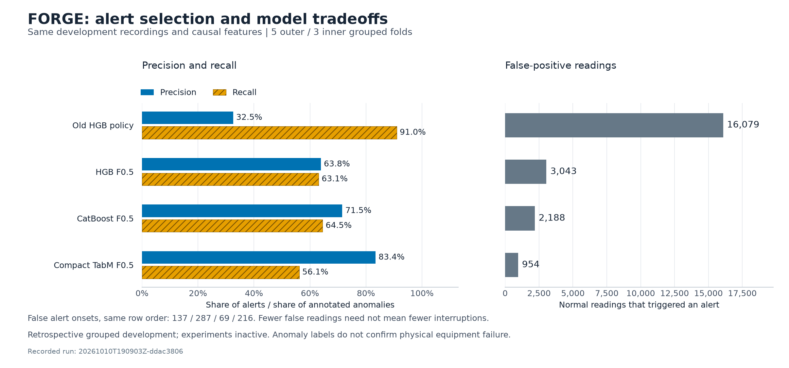

# Alert selection with HGB, CatBoost and TabM

With alert selection weighted toward precision, histogram gradient boosting
(HGB) reached 63.85% precision and 63.06% recall in this grouped development run.
Ordered CatBoost reached 71.52% precision and 64.48% recall. The compact TabM
ensemble reached 83.37% precision and 56.14% recall. All procedures used the same
previously inspected development recordings. They remain experimental, and the
active detector is unchanged.



## Why change the experiment

The [causal median experiment](refinement-results.md) reduced fragmented alerts,
but normal readings still received persistent high scores. Reviewing threshold
selection exposed a separate problem. The existing rule required 60% point recall,
60% event recall and 20% recall in every positive group before considering precision.
When no threshold met those requirements, the fallback selected the setting
that came closest to satisfying the recall floors. In two outer folds, this selected thresholds below 0.008.

The new alert-selection rule maximizes F0.5, which weights precision more
strongly than recall, without requiring those recall floors. The 95% precision
target remains a target, not a guaranteed result of this objective. A policy
that never alerts receives zero precision and zero F0.5. To measure the effect
of the selection rule, the historical control and a second procedure use exactly
the same fitted HGB models. Only their alert selection differs. CatBoost and
TabM then test whether changing the classifier improves on that second procedure.

## Models and frozen protocol

The [configuration](../configs/modern-comparison-v1.json) was written before this
run. It fixes five outer folds, three inner folds and seed 42 across the same
23 source recordings and 21 overlap groups used by the earlier audit. Only the
original training and validation partitions are opened through the hash-checked
loader. Previously inspected test CSVs are not opened by this experiment.

All classifiers receive the same 32 causal relative features and eligible
training readings. These features describe sensor changes using current and
earlier measurements. Each training overlap group receives equal total weight.
Features are computed separately within each source before overlap deduplication.
Unknown and conflicting labels are excluded from training. Normal observations
from the fitting groups supply the robust sensor scales. The first 60 unlabeled
readings of each assessment source initialize its reference and remain unavailable.
No source identifier, timestamp, anomaly label or change-point label is a predictor.

The HGB parameters remain unchanged: 200 iterations, seven maximum leaves,
30 readings per leaf, learning rate 0.05 and L2 regularization 10. CatBoost uses
explicit ordered boosting, 300 iterations, learning rate 0.05 and L2 regularization
10. Depth four and depth six are the only CatBoost candidates. Their selection
occurs inside each outer training pool. Neither tree model uses outer-fold early
stopping or an outer evaluation set.

The neural comparator uses the official TabM implementation with two blocks,
width 32, eight ensemble members, dropout 0.1 and eight fixed epochs. AdamW uses
learning rate 0.002, weight decay 0.01 and batches of 256. Its additional
StandardScaler is fitted only on that fold's training features, followed by
clipping to [-10, 10]. Each ensemble member receives its own binary cross-entropy
loss, weighted by training group. Inference averages member probabilities. There
are no numerical feature embeddings or architecture search. This is a compact
CPU configuration, not a reproduction of TabM's best published benchmark setup.
Training losses and fitted scaler statistics are retained in the saved audits.

Thresholds and three- or five-reading persistence are selected using inner
out-of-fold predictions. All four procedures use the same quantile-grid rule. F0.5
ties use precision, false-onset frequency, recall and then the higher threshold
within a model. Exact metric ties between CatBoost candidates follow the declared
order rather than comparing their score scales. Every selection is saved before
outer outcomes are assessed. No family is activated by selecting a winner from
the outer results.

## Matched results

| Measure | Historical HGB | HGB, F0.5 | Ordered CatBoost, F0.5 | Compact TabM, F0.5 |
|---|---:|---:|---:|---:|
| Precision | 32.53% | 63.85% | 71.52% | 83.37% |
| Recall | 90.95% | 63.06% | 64.48% | 56.14% |
| F0.5 | 0.3732 | 0.6369 | 0.6999 | 0.7600 |
| F1 | 0.4792 | 0.6345 | 0.6782 | 0.6710 |
| True-positive readings | 7,751 | 5,374 | 5,495 | 4,784 |
| False-positive readings | 16,079 | 3,043 | 2,188 | 954 |
| Missed anomalous readings | 771 | 3,148 | 3,027 | 3,738 |
| True-negative readings | 8,693 | 21,729 | 22,584 | 23,818 |
| Available-normal FPR | 68.50% | 12.96% | 9.32% | 4.06% |
| False alert onsets | 137 | 287 | 69 | 216 |
| False onsets / available normal hour | 21.01 | 44.02 | 10.58 | 33.13 |
| False-positive sample exposure, hours | 4.466 | 0.845 | 0.608 | 0.265 |
| Detected events | 14 / 24 | 22 / 24 | 22 / 24 | 21 / 24 |
| Median detected-event delay, seconds | 6.5 | 40.5 | 32.0 | 23.0 |
| Unavailable readings | 1,299 | 1,299 | 1,299 | 1,299 |
| Unavailable anomalous readings | 0 | 0 | 0 | 0 |
| Positive groups with zero recall | 0 | 1 | 1 | 2 |

Changing HGB's alert-selection rule removes 13,036 false-positive readings
(81.1%) relative to the historical control, while recall falls from 90.95% to
63.06%. The control reproduces the earlier audit's predictions and per-group
results exactly. Both policies use identical HGB scores, so alert selection
accounts for the precision gain.

CatBoost improves both precision and recall over HGB with the same F0.5
selection objective, while reducing false alert onsets from 287 to 69. Compact
TabM has the highest pooled F0.5 in this run and reduces false-positive readings
by 94.1% against the historical control. However, its 216 false alert onsets
exceed both CatBoost's 69 and the historical control's 137. Fewer false-positive
readings therefore do not necessarily mean fewer interruptions. None of these
procedures meets the project's combined targets of 95% precision, 1% FPR and two
false onsets per available normal hour.

False-positive sample exposure assigns one second to each false-positive reading,
matching the existing SKAB exposure convention. It is not a reconstruction of
continuous alarm duration across gaps. Available-normal FPR divides false-positive
readings by scored normal readings. Unavailable anomalous readings still count as
misses. Event detection requires a new alert onset within an annotated interval,
without point adjustment. Delay describes detected events only, and the event
sets can differ between procedures. The increase in event coverage under F0.5
does not mean more anomalous readings were detected. Shorter alert episodes can
start inside an annotated interval where an earlier long alert began outside it.

The table below compares raw-score average precision (AP), before thresholding,
within each outer assessment fold. AP uses identical available labeled readings.
Scores from separately fitted folds are not pooled into a single ranking metric.
Per-group AP is also saved, with null for single-class or empty groups.

| Outer fold | HGB AP | CatBoost AP | TabM AP | CatBoost depth |
|---|---:|---:|---:|---:|
| 1 | 0.8980 | 0.8929 | 0.8012 | 4 |
| 2 | 0.9090 | 0.9418 | 0.8811 | 4 |
| 3 | 0.8291 | 0.7864 | 0.7029 | 4 |
| 4 | 0.9388 | 0.9078 | 0.9432 | 6 |
| 5 | 0.9261 | 0.9298 | 0.8629 | 4 |

TabM's AP is below HGB's in four of the five folds, despite its higher pooled
precision and F0.5 at the selected operating points. CatBoost's AP is higher in
two folds and lower in three. The models therefore offer different tradeoffs at the selected thresholds,
without a consistent improvement in anomaly ranking from the newer architecture.
TabM's eight-epoch budget also does not establish convergence.

Selected thresholds and persistence lengths are shown as threshold / readings.
Their numeric values are specific to the fitted model and are not calibrated
failure probabilities.

| Outer fold | Historical HGB | HGB F0.5 | CatBoost F0.5 | TabM F0.5 |
|---|---:|---:|---:|---:|
| 1 | 0.007588 / 3 | 0.422858 / 3 | 0.379545 / 5 | 0.793211 / 3 |
| 2 | 0.052258 / 3 | 0.684229 / 5 | 0.730844 / 5 | 0.925560 / 3 |
| 3 | 0.002540 / 3 | 0.734681 / 5 | 0.521847 / 5 | 0.743160 / 5 |
| 4 | 0.133156 / 3 | 0.603169 / 3 | 0.598011 / 5 | 0.845082 / 5 |
| 5 | 0.321560 / 3 | 0.666105 / 3 | 0.778139 / 3 | 0.842581 / 5 |

## Recording-level failures

P and R denote precision and recall. A zero-alert group has precision zero by
convention, so silence is not treated as perfect performance. The full table is
retained because pooled precision can conceal missed recording groups.

| Group | HGB P / R | CatBoost P / R | TabM P / R | False positives: HGB / CatBoost / TabM |
|---|---:|---:|---:|---:|
| anomaly-free/anomaly-free | 12.9% / 100.0% | 18.0% / 100.0% | 33.0% / 99.5% | 2769 / 1869 / 829 |
| valve1/1 | 71.8% / 84.3% | 69.8% / 89.8% | 96.9% / 76.9% | 133 / 156 / 10 |
| valve1/6 | 86.6% / 84.9% | 88.5% / 82.0% | 100.0% / 38.5% | 53 / 43 / 0 |
| other/1 | 95.3% / 76.1% | 100.0% / 71.3% | 100.0% / 43.6% | 7 / 0 / 0 |
| valve1/8 | 99.5% / 98.8% | 99.5% / 98.2% | 100.0% / 87.2% | 2 / 2 / 0 |
| other/14 | 89.8% / 37.7% | 95.2% / 39.1% | 100.0% / 22.5% | 13 / 6 / 0 |
| valve1/2 | 0.0% / 0.0% | 0.0% / 0.0% | 0.0% / 0.0% | 0 / 0 / 0 |
| other/7 | 99.1% / 98.6% | 99.7% / 98.6% | 99.4% / 99.1% | 3 / 1 / 2 |
| valve1/9 | 100.0% / 81.8% | 100.0% / 81.8% | 100.0% / 78.1% | 0 / 0 / 0 |
| valve1/4 | 100.0% / 49.3% | 99.0% / 82.5% | 100.0% / 30.4% | 0 / 3 / 0 |
| valve1/7 | 86.9% / 82.0% | 78.7% / 93.1% | 76.5% / 89.4% | 50 / 102 / 111 |
| other/10 | 100.0% / 1.8% | 100.0% / 2.7% | 100.0% / 6.4% | 0 / 0 / 0 |
| valve1/10 | 100.0% / 80.3% | 100.0% / 80.3% | 100.0% / 80.0% | 0 / 0 / 0 |
| other/6 | 100.0% / 98.5% | 100.0% / 98.0% | 100.0% / 95.8% | 0 / 0 / 0 |
| valve1/0 | 100.0% / 7.5% | 100.0% / 10.0% | 100.0% / 0.2% | 0 / 0 / 0 |
| valve1/3 | 100.0% / 75.2% | 100.0% / 74.5% | 100.0% / 69.1% | 0 / 0 / 0 |
| valve2/1 | 100.0% / 77.2% | 100.0% / 75.1% | 100.0% / 71.8% | 0 / 0 / 0 |
| other/9 | 99.7% / 98.8% | 99.7% / 98.5% | 99.5% / 96.8% | 1 / 1 / 2 |
| valve1/5 | 100.0% / 79.4% | 100.0% / 79.2% | 100.0% / 76.2% | 0 / 0 / 0 |
| valve2/0 | 90.6% / 29.4% | 93.2% / 17.3% | 0.0% / 0.0% | 12 / 5 / 0 |
| valve1/11 | 100.0% / 73.7% | 100.0% / 73.7% | 100.0% / 75.2% | 0 / 0 / 0 |

All three F0.5 procedures miss every annotated anomaly in `valve1/2`. TabM also
misses every anomaly in `valve2/0`, and its 100% precision on `valve1/0` accompanies
only 0.2% recall. The `anomaly-free/anomaly-free` overlap group still accounts for
829 of TabM's 954 false-positive readings. That inventory group includes `other/5` and is not entirely normal. Pooled
precision alone would hide these differences in recording coverage.

All these recordings come from a limited laboratory setting and have influenced
earlier project choices. Nested refitting prevents the direct use of an outer
group during its model and threshold selection. It does not remove cumulative
overfitting from repeated development decisions. The split is by overlap group,
not a future-time or new-machine evaluation. The startup reference can also be
contaminated by a fault already present in the first 60 readings.

## Reproduce and inspect

With the base project environment and development recordings installed, add the
optional CPU training dependencies and run:

```powershell
.\.venv\Scripts\python.exe -m pip install -r requirements-torch.txt
.\.venv\Scripts\python.exe -m pip install -r requirements-modern.txt
.\.venv\Scripts\python.exe -m forge.ml.modern_comparison
.\.venv\Scripts\python.exe -m pytest tests/test_modern_comparison.py tests/test_tabm_estimator.py -q
```

To regenerate the figure from a completed run, pass its `results.json` to
`scripts/plot_modern_comparison.py` with `--output docs/assets/modern-comparison.png`.

The version snapshots describe Windows x86-64 with Python 3.13. Other supported
environments can install the `modern` project extra with their appropriate Torch
build. This run used CatBoost 1.2.10, TabM 0.0.3, Torch 2.14.1+cpu and
scikit-learn 1.9.1.

Run `20261010T190903Z-ddac3806` took 968.2 seconds with model fitting
limited to one CPU thread. That includes inner selection, outer refits, prediction,
threshold scans and artifact writes. It is one run on the development machine,
not a hardware benchmark. It saves configuration, fold assignments, training
audits, threshold scans, selected policies, prediction arrays and fitted models
under `artifacts/modern/<run-id>/`. These generated files remain ignored by Git.
Only trusted local model artifacts should be loaded. The public
[JSON result](modern-comparison-results.json) contains the recorded aggregate,
per-group and per-fold evidence, with source and configuration hashes.

All 120 targeted and regression tests passed, including 42 new checks for this
comparison and the TabM adapter. Reloading the saved CatBoost and TabM models for the first outer fold reproduced
all 14,176 assessment scores and readiness flags exactly. The historical HGB control reproduced every saved score and
per-group result from the earlier audit. All 26 protected file hashes matched.

The synthetic tests cover group boundaries, future-value invariance, training-only
standardization, label and identifier exclusion, overlap handling, complete
out-of-fold coverage, precision-policy tradeoffs and deterministic TabM fitting.
A tiny nested HGB run changes only the outer labels and verifies that the fitted
model, thresholds and predictions stay identical. Protected model pointers,
notebook bytes, split files and AI-service adapters are checked separately against
their saved hashes.

## Method references

TabM is a recent tabular neural approach built around a parameter-efficient
ensemble. CatBoost is an established boosted-tree comparator. Their published
results justify testing them here, but do not establish superiority on SKAB.

- [TabM paper, ICLR 2025](https://arxiv.org/abs/2410.24210) and [official implementation](https://github.com/yandex-research/tabm).
- [CatBoost paper, NeurIPS 2018](https://proceedings.neurips.cc/paper/2018/hash/14491b756b3a51daac41c24863285549-Abstract.html) and [official training parameters](https://catboost.ai/docs/en/references/training-parameters/common).
- [F-beta definition](https://scikit-learn.org/stable/modules/generated/sklearn.metrics.fbeta_score.html).

Further model comparisons need additional operating regimes and independently
collected recordings to assess whether these tradeoffs hold beyond the current
development groups.
